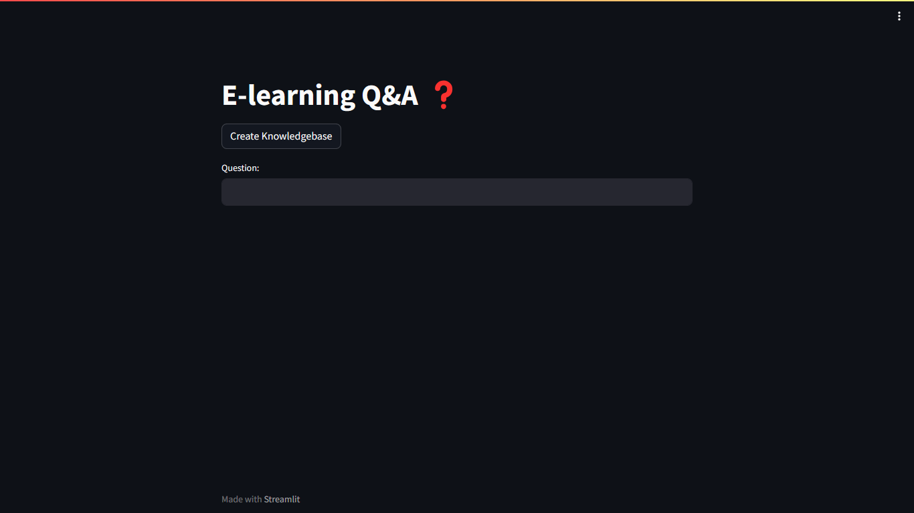

# Question & Answer System for E-Learning
 - This is an end to end LLM project based on GoogleGenAI and Langchain. In this project I built a Q&A system based on a data from an e-learning company called codebasics (website: codebasics.io). Codebasics sells data related courses and bootcamps. They have thousands of learners who uses discord server or email to ask questions. This system will provide a streamlit based user interface for students where they can ask questions and get answers.

 

## DEMO
- Check site [here](https://8504-01hwj8ynshjz7spkr595x77ec2.cloudspaces.litng.ai/)

## Project Highlights
- Use a real CSV file of FAQs that Codebasics company(E-Learning platform) is using right now.
- Their human staff will use this file to assist their course learners.
- We will build an LLM based question and answer system that can reduce the workload of their human staff.
- Students should be able to use this system to ask questions directly and get answers within seconds

## Libraries Used
 - FAISS
 - dotenv
 - streamlit
 - sentence-transformer
 - langchain + GoogleGenerativeAI
 - Huggingface instructor embeddings: Text embeddings

## Installation
 1. Prerequisites
    - Git
    - Command line familiarity
 2. Clone the Repository: `git clone https://github.com/NebeyouMusie/LLM-implementation-using-groq-api-with-streamlit.git`
 3. Create and Activate Virtual Environment (Recommended)
    - `python -m venv venv`
    - `source venv/bin/activate`
 4. Navigate to the projects directory `cd ./LLM-implementation-using-groq-api-with-streamlit` using your terminal
 4. Install Libraries: `pip install -r requirements.txt`
 5. run `streamlit run app.py`
 6. Open the link displayed in the terminal on your browser
 7. Start typing on the chat box

## Contributions
 - Contributions are welcomed

## Support
 - Give this project a star ⭐ if you like it

## Acknowledgements
 - I want to thank [codebasics]() 
   
## Author
 - LinkedIn: [Nebeyou Musie](https://www.linkedin.com/in/nebeyou-musie)
 - Gmail: nebeyoumusie@gmail.com
 - Telegram: [Nebeyou Musie](https://t.me/NebeyouMusie)

